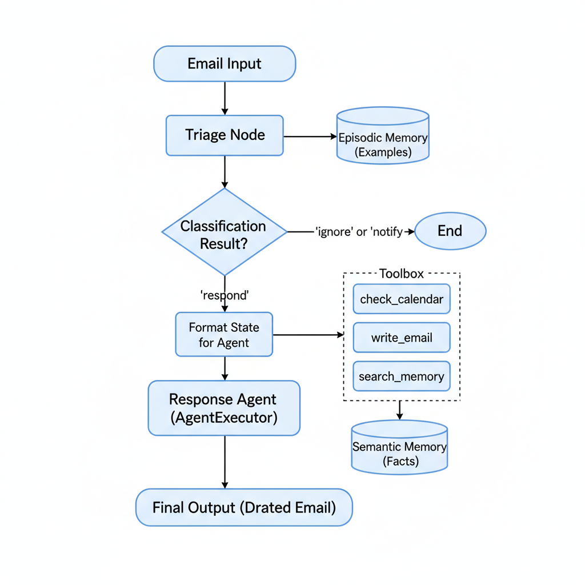

# AI Agent Architecture Document

## Overview

This document outlines the architecture of a personalized AI Email Assistant. The agent is designed to automate the management of a user's inbox by intelligently triaging incoming emails and drafting contextually relevant, stylistically personalized responses. The system is built using the LangGraph framework, with a core component being a `microsoft/Phi-3-mini` language model that has been fine-tuned using Parameter-Efficient Fine-Tuning (PEFT) to emulate the user's specific writing style. The agent leverages a multi-faceted memory system to maintain context and learn from examples.

## System Architecture

### Agent Workflow Diagram

### Interaction Flow

The agent operates as a state machine where each step modifies the shared state. The high-level flow is as follows:

1.  An **Email Input** enters the system.
2.  The **Triage Node** is triggered. It searches its **Episodic Memory** for relevant examples to create a powerful few-shot prompt.
3.  The fine-tuned LLM is called to classify the email as `ignore`, `notify`, or `respond`.
4.  The graph's **routing logic** checks the classification. If `ignore` or `notify`, the process ends.
5.  If `respond`, the task is passed to the **Response Agent Node**.
6.  The Response Agent, a ReAct-style agent, forms a multi-step plan. It can use its **Toolbox** to gather information (like checking a calendar or searching its **Semantic Memory** for facts) and take actions (like writing an email).
7.  The agent continues its thought-action-observation loop until it has enough information to generate a **Final Output** (the drafted email reply).

  <picture>
    <source media="(prefers-color-scheme: dark)" srcset="src/images/flow_chart_dark.png">
    <source media="(prefers-color-scheme: light)" srcset="src/images/flow_chart_light.png">
    
  </picture>

## Core Components

* **Fine-Tuned LLM:** The "brain" of the agent. This is a `microsoft/Phi-3-mini` model adapted with LoRA. It handles all language understanding and generation tasks.

* **LangGraph Workflow:** The "nervous system" that directs the flow of information. It manages the agent's state and routes tasks between the different nodes.

* **Triage Node:** The "gatekeeper." This component classifies incoming emails using a simplified single-word-answer prompt for high reliability.

* **Response Agent (`AgentExecutor`):** The "worker." This is a ReAct (Reasoning and Acting) agent that can think step-by-step, use tools, and draft final replies. It is equipped with a self-correction mechanism (`handle_parsing_errors=True`) to make it more robust.

* **Toolbox:** A set of capabilities the Response Agent can use.
    * `check_calendar_availability`: An information-gathering tool.
    * `write_email`: An action tool to output the final draft.
    * `search_memory_tool`: Allows the agent to query its long-term Semantic Memory.
    * `manage_memory_tool`: Allows the agent to add new facts to its Semantic Memory.

* **Memory System (`InMemoryStore`):**
    * **Episodic Memory:** Stores user-provided examples of email classifications to aid the Triage Node.
    * **Semantic Memory:** A knowledge base of user-provided facts that the Response Agent can search.

* **Embedding Model:** The "librarian" that powers the memory search. This is a `sentence-transformers/all-MiniLM-L6-v2` model that runs locally.

## Models Used

| Model Role          | Model Name                                       | Reason for Choice                                                                                                                                                             |
| :------------------ | :----------------------------------------------- | :---------------------------------------------------------------------------------------------------------------------------------------------------------------------------- |
| **Core Generative LLM** | `microsoft/Phi-3-mini` (fine-tuned with LoRA)    | Offers an excellent balance of high performance and manageable size, making it suitable for running in a free Colab environment. Fine-tuned to adopt a personalized writing style. |
| **Embedding Model** | `sentence-transformers/all-MiniLM-L6-v2`         | A high-quality and lightweight model for semantic search. It runs locally within the Colab notebook, ensuring the agent's memory system is fast, free, and private.                |